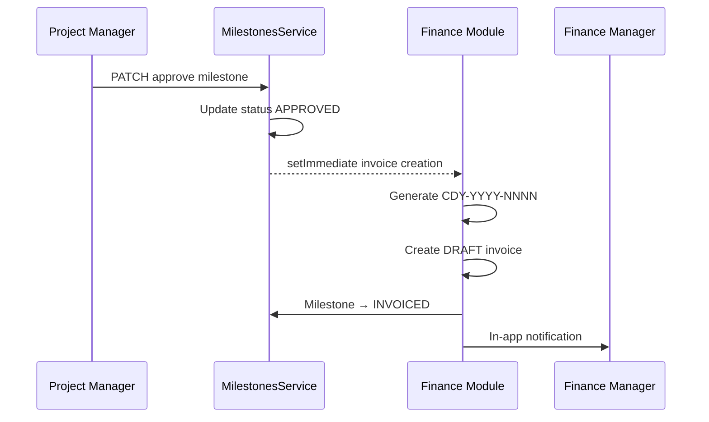

# CDY Projects Module — Complete Technical Reference

**Version:** 1.0.0  
**Released:** June 2026  
**Depends on:** Finance v2.0.0, IT/RBAC v1.0.0, CRM v1.0.0, HR v1.0.0

---

## Overview

The Projects module is the delivery engine of the CDY system. Every client engagement is managed as a project with tasks, milestones, approvals, and time tracking. It connects:

- **CRM:** projects are linked to CRM client records
- **HR:** team members are HR employee records
- **Finance:** milestone approval triggers draft invoice creation; expenses link to projects; time entries feed profitability calculations

---

## Database tables (12 total)

| Table | Description |
|---|---|
| Project | Core project record (CDY-PRJ-NNN) |
| ProjectMember | Team members assigned to a project |
| Milestone | Billable project milestones |
| Task | Individual tasks within a project |
| TaskStatusHistory | Every task status change logged |
| TaskComment | Comments on tasks |
| TimeEntry | Hours logged per task/project |
| ProjectFile | Files attached to projects/tasks |
| DeliverableApproval | Client sign-off on deliverables |
| ProjectActivity | Unified project event log |
| HourlyRate | Internal cost rate per employee |
| ProjectReport | Saved report snapshots (status, handover, profitability) |

### Sprint 17 indexes

Composite indexes on `Project`, `Task`, `TimeEntry`, `Milestone`, and `ProjectActivity` optimise portfolio reports, workload queries, and kanban filtering.

---

## API reference

### Projects

| Method | Path | Permission | Description |
|---|---|---|---|
| POST | `/projects` | projects.all WRITE | Create project |
| GET | `/projects` | projects.all READ | List all projects |
| GET | `/projects/my` | projects.own READ | My assigned projects |
| GET | `/projects/summary` | projects.all READ | Dashboard metrics |
| GET | `/projects/workload` | projects.reports READ | Team workload |
| GET | `/projects/:id` | projects.all READ | Project detail |
| PATCH | `/projects/:id` | projects.all WRITE | Update project |
| PATCH | `/projects/:id/complete` | projects.all WRITE | Complete project (with acknowledgement flags) |
| PATCH | `/projects/:id/archive` | projects.all WRITE | Archive project |
| PATCH | `/projects/:id/on-hold` | projects.all WRITE | Put on hold |
| PATCH | `/projects/:id/reactivate` | projects.all WRITE | Reactivate |
| GET | `/projects/:id/progress` | projects.all READ | Task progress |
| GET | `/projects/:id/profitability` | projects.reports READ | P&L |
| GET | `/projects/:id/status-report` | projects.all READ | Status report |
| POST | `/projects/:id/handover-report` | projects.all WRITE | Generate handover |
| GET | `/projects/:id/handover-report` | projects.all READ | Get latest handover |
| POST | `/projects/:id/members` | projects.all WRITE | Add member |
| DELETE | `/projects/:id/members/:empId` | projects.all WRITE | Remove member |

### Milestones

| Method | Path | Permission | Description |
|---|---|---|---|
| GET | `/projects/:id/milestones` | projects.all READ | List milestones |
| POST | `/projects/:id/milestones` | projects.all WRITE | Create milestone |
| PATCH | `/projects/:id/milestones/:milId` | projects.all WRITE | Update milestone |
| PATCH | `/projects/:id/milestones/:milId/complete` | projects.tasks WRITE | Mark complete |
| PATCH | `/projects/:id/milestones/:milId/approve` | projects.approvals WRITE | Approve → invoice |

### Tasks

| Method | Path | Permission | Description |
|---|---|---|---|
| GET | `/projects/:id/tasks` | projects.tasks READ | List tasks |
| POST | `/projects/:id/tasks` | projects.tasks WRITE | Create task |
| POST | `/projects/:id/tasks/import` | projects.tasks WRITE | Import from CSV |
| GET | `/projects/:id/tasks/:taskId` | projects.tasks READ | Task detail |
| PATCH | `/projects/:id/tasks/:taskId` | projects.tasks WRITE | Update task |
| PATCH | `/projects/:id/tasks/:taskId/status` | projects.tasks WRITE | Update status |
| DELETE | `/projects/:id/tasks/:taskId` | projects.tasks WRITE | Delete task |
| POST | `/projects/:id/tasks/:taskId/comments` | projects.tasks WRITE | Add comment |

### Approvals

| Method | Path | Permission | Description |
|---|---|---|---|
| POST | `/projects/:id/tasks/:taskId/approvals` | projects.approvals WRITE | Request approval |
| GET | `/projects/:id/approvals` | projects.approvals READ | All project approvals |
| PATCH | `/projects/:id/approvals/:approvalId/decision` | projects.approvals WRITE | Record decision |

### Time tracking

| Method | Path | Permission | Description |
|---|---|---|---|
| POST | `/projects/:id/time` | projects.time WRITE | Log time |
| GET | `/projects/:id/time` | projects.time READ | Time entries |
| GET | `/projects/:id/time/summary` | projects.time READ | Summary with costs |

### Reports

| Method | Path | Permission | Description |
|---|---|---|---|
| GET | `/projects/reports/portfolio` | projects.reports READ | Portfolio health |
| GET | `/projects/reports/budget` | projects.reports READ | Budget vs actual |

---

## Milestone → Invoice flow



When a milestone is approved:

1. `MilestonesService.approve()` updates milestone status to APPROVED
2. `setImmediate` fires (non-blocking):
   - `InvoiceNumberService.generate()` creates CDY-YYYY-NNNN
   - `Invoice` created in Finance with DRAFT status
   - Milestone updated to INVOICED with invoiceId linked
   - Finance Manager notified via in-app notification
3. Finance Manager reviews and sends the invoice
4. Finance failure NEVER blocks milestone approval

---

## Profitability calculation

| Component | Source |
|---|---|
| Revenue | Sum of Finance invoices linked via milestone (non-DRAFT) |
| Labour cost | Sum of billable time entries × employee hourly rate |
| Hourly rate | Explicit `HourlyRate` record OR salary ÷ 22 ÷ 8 (fallback) |
| Direct expenses | Sum of Finance expenses with matching `projectId` |
| Gross profit | Revenue − Labour cost − Direct expenses |
| Gross margin | Gross profit / Revenue × 100 |

---

## Redis caching

| Key pattern | TTL | Invalidated on |
|---|---|---|
| `projects:summary` | 60s | Task status change, project complete, project create/update |
| `projects:progress:{id}` | 60s | Task create/status change |
| `projects:profitability:{id}` | 120s | Time entry logged, milestone approved |
| `projects:workload` | 120s | Task status change |
| `projects:portfolio:*` | 300s | Project complete, milestone approved |
| `projects:budget-actual:*` | 300s | Time entry logged, milestone approved, project complete |

---

## Project completion workflow

Completing a project requires `ACTIVE` status. The API checks:

1. **Incomplete tasks** — returns 400 unless `acknowledgeIncompleteTasks: true`
2. **Uninvoiced milestones** (with billing amount > 0) — returns 400 unless `acknowledgeUninvoicedMilestones: true`

On success: status → COMPLETED, CEO and Finance Manager notified, caches invalidated. Handover report can then be generated (COMPLETED projects only).

---

## Automation (cron jobs)

| Time | Job | Description |
|---|---|---|
| 7:30am | project-deadline-alerts | 48h warnings to assignees; overdue summary to PMs |

---

## Access control

| Role | projects.all | projects.own | projects.tasks | projects.approvals | projects.time | projects.reports |
|---|---|---|---|---|---|---|
| CEO | R | — | — | R | — | R |
| Finance Manager | R | — | — | R | — | — |
| Operations Manager | R+W | — | R+W | R+W | R+W | R+W |
| Project Manager | R+W | — | R+W | R+W | R+W | R |
| Team Member | — | R | R+W | — | R+W | — |
| Sales Agent | — | R | — | — | — | — |

---

## Frontend routes

| Route | Permission | Description |
|---|---|---|
| `/projects` | projects.all | Overview and project list |
| `/projects/my` | projects.own | My tasks |
| `/projects/workload` | projects.reports | Team workload |
| `/projects/reports` | projects.reports | Reports landing |
| `/projects/reports/portfolio` | projects.reports | Portfolio health matrix |
| `/projects/reports/budget` | projects.reports | Budget vs actual |
| `/projects/:id` | projects.all | Project detail (kanban) |
| `/projects/:id/handover` | projects.all | Handover report |
| `/projects/:id/profitability` | projects.reports | P&L view |

---

## Known limitations

- File storage uses Cloudflare R2 — files must be accessed via CDY system
- Client portal (external client login) deferred to future sprint
- Gantt chart view deferred to future sprint
- Real-time collaboration not yet implemented
- Task dependencies deferred to future sprint
- Public handover share link (unauthenticated) deferred — copy-to-text and print available

---

## Release

**Tag:** `v1.0.0-projects`  
**Migration:** `20260710100000_sprint17_projects_completion_indexes`

> **Note:** Sprint 14 migration must be `20260629100000_sprint14_hr_performance_salary_history` (not `20260610100000`). See DEPLOYMENT.md if you hit P3009 on production.

```bash
docker compose exec api npx prisma migrate deploy
docker compose exec api npx prisma generate
git tag v1.0.0-projects
git push origin HEAD --tags
```
